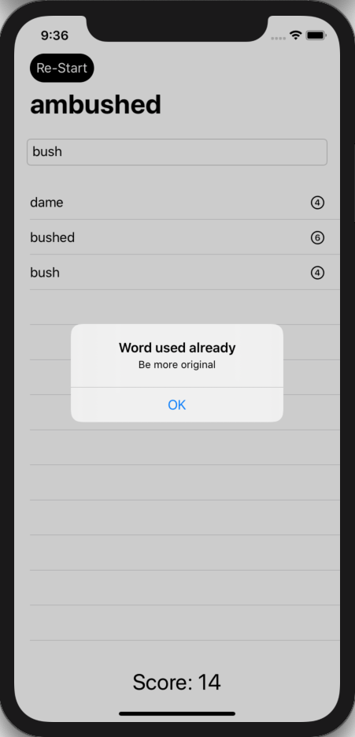
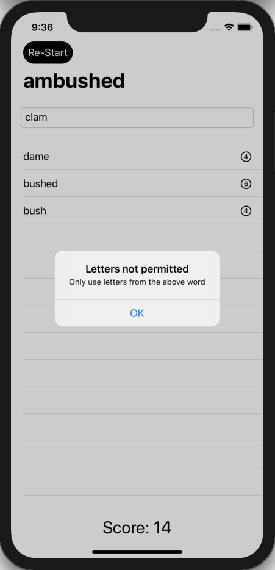

# 100 Days of SwiftUI Project 6

## Word Scramble App

**App Description:**  Application to test the user's ability to make as many words as possible from the letters of a randomly chosen 8 letter word.

**Swift Features Used:**
List, onAppear, Bundle, fatalError(), UITextChecker, Navigation View.

**Screenshots:**

